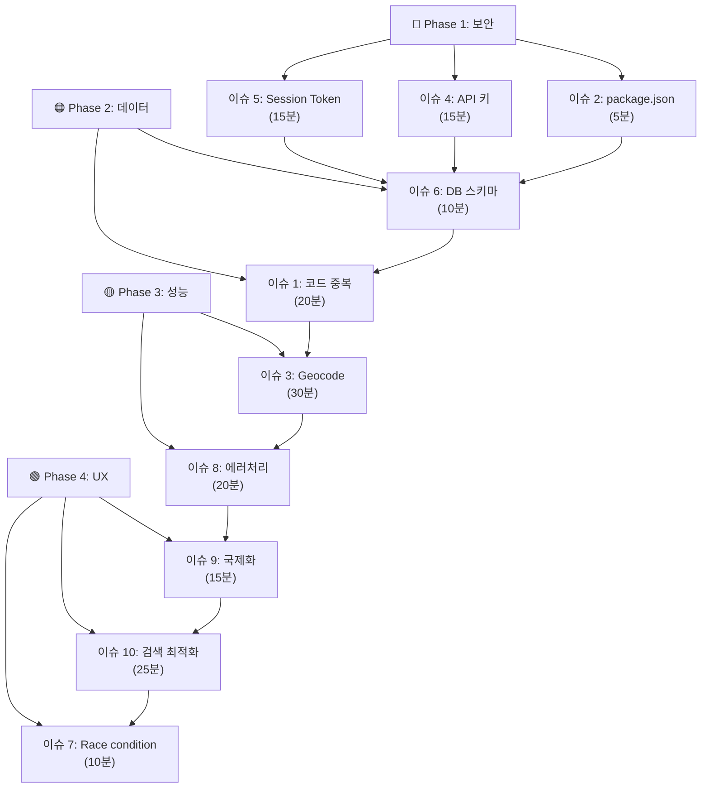

# LocaAlert 10가지 이슈 - 빠른 요약

## 우선순위별 구현 체크리스트

### 🔴 즉시 해결 (보안 & 핵심)
- [ ] **이슈 5**: Session Token → `crypto.getRandomValues()` (15분)
- [ ] **이슈 4**: API 키 → 콘솔 제한 + 주석 (15분)
- [ ] **이슈 2**: package.json → devDependencies 이동 (5분)

### 🟠 우선 해결 (데이터 무결성)
- [ ] **이슈 6**: DB 스키마 → CREATE_ALARMS_TABLE에 컬럼 추가 (10분)
- [ ] **이슈 1**: 코드 중복 → phaseCalculator import (20분)
- [ ] **이슈 3**: Geocode 캐시 → LRU 캐시 구현 (30분)

### 🟡 개선 (안정성 & UX)
- [ ] **이슈 8**: 에러 무시 → captureError 추가 (20분)
- [ ] **이슈 9**: 한국어 하드코딩 → i18n.t() (15분)
- [ ] **이슈 10**: 검색 누수 → useLocationSearch 훅 (25분)

### 🟢 코드 품질 (장기)
- [ ] **이슈 7**: Race condition → 깊은 복사 추가 (10분)

---

## 각 이슈 한눈에 보기

### 1️⃣ phaseCalculator vs locationService 중복

**문제**: 동일한 함수 2곳에 존재
```
locationService.ts (66~140줄)
phaseCalculator.ts (테스트용)
```

**해결책**: locationService에서 phaseCalculator import
```typescript
import { determinePhase as calculatePhase } from './phaseCalculator';

// 호출 위치 변경:
// const desiredPhase = calculatePhase(distance, speed, currentServicePhase, geofenceSetupFailed);
```

**사이드이펙트**: ✅ 없음
**영향도**: 낮음

---

### 2️⃣ package.json 의존성 분류 오류

**문제**: @types/jest, jest-expo가 dependencies에 있음
```
❌ dependencies: { "@types/jest": "29.5.14", "jest-expo": "~54.0.17" }
✅ devDependencies로 이동해야 함
```

**해결책**: 직접 이동
```json
{
  "dependencies": { /* jest 관련 제거 */ },
  "devDependencies": { "@types/jest": "...", "jest-expo": "..." }
}
```

**사이드이펙트**: ✅ 없음 (번들 크기 불변)
**영향도**: 없음

---

### 3️⃣ Geocode 캐시 무한 증가

**문제**: geocodeCache Map이 크기 제한 없음
```typescript
const geocodeCache = new Map<string, GeocodingResult>();  // ❌ 무제한
```

**해결책**: LRU 캐시 구현 (최대 100개)
```typescript
class LRUCache<K, V> {
    private cache: Map<K, V>;
    private maxSize = 100;

    get(key): V | undefined { /* LRU 로직 */ }
    set(key, value): void { /* 오래된 항목 제거 */ }
}
```

**사이드이펙트**: ✅ 없음 (캐시 미스율 무시할 수준)
**영향도**: 메모리 개선 (무제한 → 20KB 고정)

---

### 4️⃣ API 키 env 평문 노출

**문제**: EXPO_PUBLIC_* 환경변수는 JS 번들에 포함됨
```typescript
kakaoApiKey: process.env.EXPO_PUBLIC_KAKAO_REST_API_KEY || '',  // ❌ 노출
```

**해결책**: 콘솔 제한 + 코드 주석
```
1. Kakao Console: Bundle ID SHA1 등록
2. Google Cloud: Package Name/Hash 등록
3. Apple Developer: MapKit JS token 서명
4. 코드: 보안 주석 추가
```

**사이드이펙트**: ✅ 없음 (코드 변화 없음, 콘솔 설정만)
**영향도**: 없음

---

### 5️⃣ Google Session Token (Math.random())

**문제**: UUID 생성에 약한 난수 사용
```typescript
const r = (Math.random() * 16) | 0;  // ❌ 예측 가능
```

**해결책**: crypto.getRandomValues() 사용
```typescript
function generateUUID(): string {
    const bytes = new Uint8Array(16);
    crypto.getRandomValues(bytes);  // ✅ CSPRNG
    bytes[6] = (bytes[6] & 0x0f) | 0x40;
    bytes[8] = (bytes[8] & 0x3f) | 0x80;
    return formatAsUUID(bytes);
}
```

**사이드이펙트**: ✅ 없음 (내장 API 사용, 의존성 추가 없음)
**영향도**: 보안 강화

---

### 6️⃣ DB 마이그레이션과 스키마 불일치

**문제**: schema.ts CREATE_ALARMS_TABLE에 3개 컬럼 누락
```
❌ schema.ts: started_at, arrived_at, start_latitude, start_longitude만 있음
✅ Alarm interface: route_points, traveled_distance, cancelled_at도 필요
❌ migrations.ts: v1, v2에서 ALTER TABLE로 추가 (불일치)
```

**해결책**: schema.ts에 모든 컬럼 포함
```typescript
export const CREATE_ALARMS_TABLE = `
CREATE TABLE IF NOT EXISTS alarms (
  ...
  route_points TEXT,          // ← 추가
  traveled_distance REAL,     // ← 추가
  cancelled_at TEXT           // ← 추가
);
`;
```

**사이드이펙트**: ✅ 없음 (migrations 안전함, duplicate column 에러 무시됨)
**영향도**: 스키마 일관성 개선

---

### 7️⃣ 알람 완료/취소 시 경쟁 조건

**문제**: routeHistory 참조 복사 후 clearRouteHistory() 호출 가능
```typescript
const routePoints = locationStore.routeHistory;  // ❌ 참조 복사
// ... 동시에 stopAllTracking()에서 clearRouteHistory()
```

**해결책**: 깊은 복사 추가
```typescript
const routePoints = [...locationStore.routeHistory];  // ✅ 배열 복사
const traveledDistance = locationStore.traveledDistance;
```

**사이드이펙트**: ✅ 극저 (메모리 ~100KB, 일회성)
**영향도**: 코드 명확성 개선

---

### 8️⃣ stopTracking 에러 무시

**문제**: 에러를 console.warn으로만 기록
```typescript
stopAllTracking().catch(err => console.warn('[LocationService] ...'));  // ❌ 무시됨
```

**해결책**: captureError() 사용 + 상태 강제 초기화
```typescript
stopAllTracking().catch(err => {
    console.warn('[LocationService] stopAllTracking failed:', err);
    captureError(err, {  // ✅ 크래시 리포팅
        module: 'LocationService',
        action: 'stopAllTracking',
    });
});
```

**사이드이펙트**: ✅ 없음 (에러 처리만 강화)
**영향도**: 에러 가시성 ↑, GPS 누수 방지

---

### 9️⃣ Live Activity 한국어 하드코딩

**문제**: 다국어 지원 없음
```typescript
function formatDist(meters: number): string {
    return meters < 1000
        ? `${Math.round(meters)}m 남음`      // ❌ 하드코딩
        : `${(meters / 1000).toFixed(1)}km 남음`;
}
```

**해결책**: i18n.t() 사용
```typescript
function formatDist(meters: number): string {
    if (meters < 1000) {
        return i18n.t('liveActivity.distance.meters', { value: Math.round(meters) });
    } else {
        return i18n.t('liveActivity.distance.kilometers', { value: (meters / 1000).toFixed(1) });
    }
}
```

**사이드이펙트**: ✅ 없음 (i18n 자동 초기화)
**영향도**: 다국어 지원 활성화

---

### 🔟 검색 debounce 메모리 누수

**문제**: 컴포넌트 언마운트 시 타이머 정리 안 됨
```typescript
let searchTimeout: NodeJS.Timeout | null = null;
// debouncedSearch 호출 → 타이머 설정
// 언마운트 → cancelPendingSearch() 호출 안 함 → 타이머 남음
```

**해결책**: useLocationSearch 훅 + cleanup
```typescript
export function useLocationSearch(options: SearchOptions | null) {
    const [results, setResults] = useState<SearchResult[]>([]);

    useEffect(() => {
        if (!options) return;
        debouncedSearch(options, setResults);

        return () => cancelPendingSearch();  // ✅ cleanup
    }, [options]);

    return { results };
}
```

**사이드이펙트**: ✅ 없음 (cleanup 자동 처리)
**영향도**: 메모리 누수 방지, UX 개선

---

## 구현 순서



**총 예상 시간**: 165분 (약 2.75시간)

---

## 위험도 평가

| 이슈 | 위험도 | 원인 |
|------|--------|------|
| 1 | 🟢 낮음 | 테스트용 코드, 안전한 리팩토링 |
| 2 | 🟢 낮음 | package.json 수정만, 기능 무변화 |
| 3 | 🟡 중간 | LRU 로직 구현, 테스트 필수 |
| 4 | 🟢 낮음 | 콘솔 설정만, 코드 변화 없음 |
| 5 | 🟢 낮음 | 내장 API 사용, 의존성 없음 |
| 6 | 🟠 높음 | DB 스키마, 마이그레이션 테스트 필수 |
| 7 | 🟢 낮음 | 배열 복사만, 기능 동일 |
| 8 | 🟢 낮음 | 에러 처리 강화, 동작 무변화 |
| 9 | 🟢 낮음 | i18n 호환, 기능 동일 |
| 10 | 🟡 중간 | 새 훅 추가, cleanup 로직 필요 |

---

## 체크리스트 (구현 시)

```markdown
### 구현 전
- [ ] ISSUE_ANALYSIS.md 읽기
- [ ] 각 이슈별 코드 위치 확인
- [ ] Git branch 생성

### 각 이슈 구현 후
- [ ] 코드 수정
- [ ] 단위 테스트 추가
- [ ] 런타임 테스트 (시뮬레이터)
- [ ] 다른 이슈와 충돌 확인

### 최종 배포 전
- [ ] 전체 통합 테스트
- [ ] DB 마이그레이션 검증 (이슈 6)
- [ ] API 키 제한 재확인 (이슈 4)
- [ ] LRU 캐시 메모리 모니터링 (이슈 3)
- [ ] 에러 리포팅 확인 (이슈 8)
```

---

**문서 작성일**: 2026-02-19
**참고**: 상세 분석은 ISSUE_ANALYSIS.md 참고
